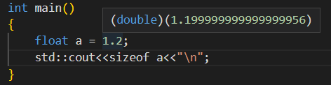

# how c++ works

include

就是直接copy paste

x86 就是32


每个cpp都会生成.obj(windows) or .o(unix) 文件

link就会把这些文件拼接起来生成一个目标文件


# how compiling works

具体的在编译原理的仓库中

file does not mean anything

## 预处理

### include

编译中的include，就是复制粘贴

a.h

```
}
```

b.cpp

```
int a()
{
#include"a.h"
```

编译后程序正常执行

### define

就是简单的替换

### #if 

```
#if 1
...
#endif
```

...的部分就会编译否则不会


## **如果只是dbg，编译器不会优化**

## link

每个函数都会有一个签名，看起来就是随机数字


# 变量

```
char a = 56;//works
```


float 4bytes; double 8 bytes

```
//if we declare in this way
float a = 1.2;// auctually a will be a double value;
//so what we should do to declare a float 
float b = 12f;//add f or F at the end
```



为什么bool是一个byte不是一个bit

因为寻址问题 ，具体看计组或者os

sizeof 运算符 ，他不是函数


# function

最好减少函数调用，因为地址的跳转耗时


# Head file

```
#pragma once
```

```
#include<> 在include目录下 只用于编译器包含路径
#include"" 相对当前的
```


# debug

打断点，一步一步执行

step into: 进入到函数体内

step over: 从当前函数跳到下一行代码

step out: 跳出当前函数，回到调用这个函数的位置

在watch那里查看变量的类型和值

查看内存，&var

未初始化，为0xcccccccc

可以反汇编


# pointer

存储内存地址的整数,这就是为什么在条件语句中可以用这个作为条件

指针类型只是方便我们看程序，不重要，全部指定为void* 完全是ok的。这就是为什么很多c++提供的接口的类型是void*

但是类型对内存的操作很重要，编译器需要知道要操作多大的内存

& 取地址

\* 解引用

```c++
char * buf = new char[8];
memset(buf,0,8);//把8个从buf开始的值设为0

//double pointer
char** buf = &buf;

delete[] buf;

```


## 引用

就是指针的语法糖

alias 只是一个别名，编译后，不存在这个名字，只存在在源码中。

# class/struct

就是只有默认访问权限不一样而已， that is all

结构体也可以继承多态


# static

类内：static means 只有这一个实例，他被共享。记得在类外还要声明一次。这些变量是属于类，不属于实例。静态方法只能使用静态变量

类外：这个变量只在这个编译单元//有点private的感觉


local static

```c++
void fun()
{
    static int a = 0;
    a++;
    cout<<a;
}
//调用五次
//输出 1 2 3 4 5
```

例子：统一目录下

a.cpp

```
int a = 2；
```

b.cpp

```
int a = 4；
```

编译为出错，链接错误

解决方法1：

将其中一个改为static

解决方法2：

将其中一个改为

```
external int a;//external linking
```


# enum

```c++
enum e
{
    A=5,B
}
enum e: char
{
    A = 12
}
```


# 构造和析构

```
class A
{
	A();//在创建实例的时候执行
	~A();//对象销毁时执行，用来处理堆数据
}
```

```
class A
{
	//参数列表是保证只初始化一次
	var;
	A(): var(value)//注意按照顺序
}
```

```
class B
{
	A a;
	A()
	{
		a(1);
	}
	//结果就是调用了两次A， 一次在A a; 一次在A()
}
```


# const/mutable

```c++
const int MAX = 90;

int *a = new int;
*a = 2;
a = (int*)&MAX;

//const 在*前
const int *a = new int;
*a = 2;//work
a = (int*)&MAX;// error
//const 在*后
int* const a = new int;
*a = 2;//error
a = (int*)&MAX;// work

//类里面
class A
{
    mutable int a;
    int getX();//不能被const对象调用
    int getX()const;//不能修改类里面的值 改方法只能被const对象调用
    void t() const
    {
        a=1;//可以改变mutable的变量
	}
}
```


lambda 

```c++
int x = 8;
auto f = [=]()//=
{
    x++;//error
}
auto f = [=]()
{
    int y = x;
    y++;//work
}
auto f = [=]() mutable
{
    x++;//work
}

```


# lambda

```
[ capture ] ( params ) opt -> ret { body; };
其中 capture 是捕获列表，params 是参数表，opt 是函数选项，ret 是返回值类型，body是函数体。
```

```
capture
lambda 表达式还可以通过捕获列表捕获一定范围内的变量：
    [] 不捕获任何变量。
    [&] 捕获外部作用域中所有变量，并作为引用在函数体中使用（按引用捕获）。
    [=] 捕获外部作用域中所有变量，并作为副本在函数体中使用（按值捕获）。
    [=，&foo] 按值捕获外部作用域中所有变量，并按引用捕获 foo 变量。
    [bar] 按值捕获 bar 变量，同时不捕获其他变量。
    [this] 捕获当前类中的 this 指针，让 lambda 表达式拥有和当前类成员函数同样的访问权限。如果已经使用了 & 或者 =，就默认添加此选项。捕获 this 的目的是可以在 lamda 中使用当前类的成员函数和成员变量。

```


```
[](){}这样是编译器根据return语句可以推测返回类型
[]{} 无参数可以省略()
```

```c++
class A
{
    public:
    int i_ = 0;
    void func(int x, int y)
    {
        auto x1 = []{ return i_; };                    // error，没有捕获外部变量
        auto x2 = [=]{ return i_ + x + y; };           // OK，捕获所有外部变量
        auto x3 = [&]{ return i_ + x + y; };           // OK，捕获所有外部变量
        auto x4 = [this]{ return i_; };                // OK，捕获this指针
        auto x5 = [this]{ return i_ + x + y; };        // error，没有捕获x、y
        auto x6 = [this, x, y]{ return i_ + x + y; };  // OK，捕获this指针、x、y
        auto x7 = [this]{ return i_++; };              // OK，捕获this指针，并修改成员的值
    }
};
int a = 0, b = 1;
auto f1 = []{ return a; };               // error，没有捕获外部变量
auto f2 = [&]{ return a++; };            // OK，捕获所有外部变量，并对a执行自加运算
auto f3 = [=]{ return a; };              // OK，捕获所有外部变量，并返回a
auto f4 = [=]{ return a++; };            // error，a是以复制方式捕获的，无法修改
auto f5 = [a]{ return a + b; };          // error，没有捕获变量b
auto f6 = [a, &b]{ return a + (b++); };  // OK，捕获a和b的引用，并对b做自加运算
auto f7 = [=, &b]{ return a + (b++); };  // OK，捕获所有外部变量和b的引用，并对b做自加运算
```


lambda 表达式的类型在 C++11 中被称为“闭包类型（Closure Type）”。它是一个特殊的，匿名的非 nunion 的类类型。

 因此，我们可以认为它是一个带有 operator() 的类，即仿函数。因此，我们可以使用 std::function 和 std::bind 来存储和操作 lambda 表达式：

```c++
    std::function<int(int)>  f1 = [](int a){ return a; };
    std::function<int(void)> f2 = std::bind([](int a){ return a; }, 123);

    using func_t = int(*)(int);
    func_t f = [](int a){ return a; };
    f(123);
```


# 堆栈

```
//栈 一般很小 faster
会自动有push 和pop 就不用手动销毁
A a;

//栈 手动申请，手动销毁
// new 会在free list中找到适合的内存 返回申请的内存的内存地址
// new会call构造函数
// new是操作符
A* a = new A();
new A[10];//连续的内存空间

new 与 malloc
//唯一区别就是new会调用构造函数，malloc只是分配内存
A* a =new A();
A*a = (A*) malloc(sizeof(A));

delete a;
```


# 显/隐转换

c++只做一次转换

比如

```c++
class A
{
    int a;
    A(int a){}
    A(string a){}
}

void print(A a);
int main()
{
    A a = 12;//works
    A a = "a";//works
    print(string("aaa"));
}
```


```c++
class A
{
    int a;
    explict A(int a){}
    A(string a){}
}
A a = 12;//error 必须显示调用
```


# 运算符重载

return-type operator op(params);


在某个作用域的变量在栈上，出了作用域就会被pop

 错误写法

```
int *create()
{
	int array[50];
	return array;
}
返回的是栈上的内存地址
```


# Smart pointer

```c++
#include<memory>
{
    //在栈上的指针
    std::unique_ptr<A> a(new A());//需要显式调用
    std::unique_ptr<A> a = std::make_unique<A>();//safer
    
}
```

```
//会有一个count
std::shared_ptr<A>a = std::make_shared<A>();

```


# copy

```
String(const char* str)
{
	size = strlen(str);
	buf = new char[size+1];//+1是为了空终止符
	memcpy(buf,string,size+1);
	//或者
	memcpy(buf,string,size);
	buf[size]=0;
}
```


```cpp
//shadow copy
直接 用 =
    = 就是简单的值赋值
会直接赋值，指针的值也是直接赋值，所以，当复制后，析构后，会删除同一个内存两次，所以会有error

//deep copy
 所以需要重新申请一块内存
默认给的就是
String (const String& other):buf(other.buf)
{
    
}
或者
String (const String& other)
{
	memcpy(this,&other,sizeof(String));    
}

//需要修改为
String (const String& other)
{
    memcpy(this->buf,other.buf,size+1);
}

```

引用最好有const，会有优化。


# 数组

最好存对象，不存指针。

遍历

```
//减少copy
for(const & a: as)
{
	cout<<a;
}
```

vector

基础的api自己搜索

```
//如果没有指定申请的大小
std::vector<>.push_back();//会copy从栈到vector申请的内存
//优化
reserve();//指定大小
//再优化
不使用push_back 使用emplace_back(构造器的参数);//直接再vector中构造，而不是再main函数中构造后再复制给vector 
//push_back会调用复制构造函数

```


# 静/动态库

静态库就是编译到exe或者链接到exe  //可能被编译器优化。

动态库，再运行的时候装载


宏 macros

```
#include"" 会首先找相对路径的,然后再去编译器的include路径
#include<>


除了要include外部库
还要链接。
```


```cpp
如果不包含库，直接链接，也是可以的，链接嘛
但是如果你使用的是C编译的库
external "C" int init();

```


一般头文件支持动态和静态

再代码中引入静态库

```
#pragma comment(lib,"**.lib")	
```

代码中使用动态库

```
LoadLibrary(".dll");
```

使用g++

```shell
g++ -c Engine.cpp
ar crv e.lib Engine.o
g++ main.cpp e.lib -o a
a.exe
```


```
echo "# deep_of_c-" >> README.md
git init
git add README.md
git commit -m "first commit"
git branch -M main
git remote add origin git@github.com:wuweipower/deep_of_c-.git
git push -u origin main
```

